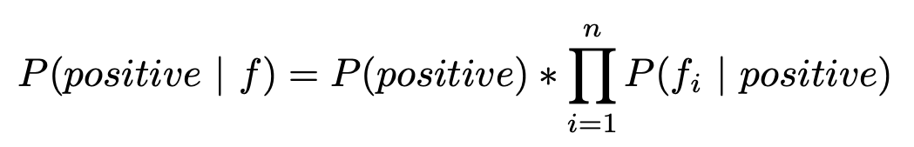
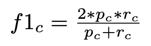

# Assignment 4 - Naïve Bayes


## The Premise

Since selling your startup ChowRider and entering the coveted tres comas club, thereafter going through a phase of boredom followed by board games, you’ve turned to movies. Your state-of-the-art home theater in your basement is all set up and ready – the only thing missing is a good movie to watch on that humongous silver screen. You went to movie review sites to find good movies, but there are just so many reviews! You can’t possibly take time off from your boredom to read movie reviews, can you? No. Instead, you’ve resorted to making a nifty AI that’ll help you to go through all those reviews in no time. Nothing fancy, just a sentiment classifier that categorizes movie reviews as positive or negative based on the text in each review. Once you have the classifications, you’re just going to count the positives and the negatives and decide on movies using majority vote. You’ve decided to implement a Naïve Bayes Classifier for your AI. You’ve collected a corpus of movie reviews (“corpus” is just ML-speak for text dataset) that you will train and test your classifier on. You’ve paid your trusted buddies at TestFriendForever (TFF) to label each movie review in the corpus to be either positive (5-star) or negative (1-star). Only 5-star and 1-star reviews are included in the corpus. You don’t care about other movies that are in the middle. You just want to separate the very best from the very worst.


## The Task

You want to implement the best possible Naïve Bayes Classifier for sentiment analysis. TFF has supplied you with some starter code in `naive_bayes.py`, which contains the definition of a class for the Naïve Bayes Classifier.
The `train` function of the classifier class should take a list of lines from the dataset (the format of each line is described below). 
The `classify` function should take another list of lines to be classified and return a Python list of strings indicating the predicted class (1 or 5).


As guidance, TFF has advised that you are free to add any additional class variables, member functions, or helper functions that you like, as long as such components do not implement substantial portions of your Naïve Bayes Classifier. Also, you are free to manage your data in any format convenient for you.


TFF has also said that to create the best possible classifier, you will want to consider many ways to improve the classifier. Some ways to improve the classifer include the following:

* using add-one smoothing
* removing capitalization
* removing punctuation
* removing stop words
* stemming
* using TF-IDF
* using bigrams

There are many more ways to improve your classifier. Implement some subset of these improvements (what's listed above and others), and find some combination that creates the best classifier.


### The Naïve Bayes Algorithm

The probability of a review being positive given a set of features $f$ can be calculated as:


Since probabilities can become very small, the product of these numbers can result in underflow. To get around this, use *log-probabilities* (in which case, products become sums).


## The Evaluation

You're on a mission to construct the best Naïve Bayes Classifier possible for the dataset, right? To evaluate how well your classifier perfoms, TFF will train and test your classifier on the given dataset and calculate an F-score (see below) for each of the two classes (positive and negative). Your classifier needs to perform above a minimum F-score theshold.

__Note:__ You may be wondering why TFF will both *train* and test your classifier; why not just *test*? That's because unlike with other ML algorithms, you will not give TFF some trained model parameters that they can then test by using the model to classify some test data. Instead, given how Naïve Bayes "trains," they will use your code to both train and test your classifier implementation.

The provided test does a 90-10 split of the dataset, using 90% of the data for training and the other 10% for testing.  TFF has also kindly provided a function to calculate the F-score for evaluating the performance of your classifier on the test data. The test in `main.py` will check the F-score for both the positive and negative classes. You set a high bar for yourself, so TFF is expecting your F-score for positive classification to be 0.90 or above and that for negative classification to be 0.6 or above.


### F-score

The `f_score()` function in `main.py` calculates `F1`, an F-score that takes into account the *precision* and the *recall* of the classifier for a given class:



The formula above represents the F1 score, specifically for a class labeled **_c_**. The F1 score is a metric often used in classification tasks to evaluate the balance between precision and recall for a particular class.

Here’s what each symbol represents:

- **_p<sub>c</sub>_**: Precision for class **_c_**. Precision measures how many of the instances predicted as class **_c_** are actually correct.
- **_r<sub>c</sub>_**: Recall for class **_c_**. Recall measures how many of the actual instances of class **_c_** are correctly identified.

The F1 score is calculated as the harmonic mean of precision and recall.

#### Why use the harmonic mean?
The harmonic mean is used because it gives a balanced score that penalizes extreme values more than the arithmetic mean. If either precision or recall is very low, the F1 score will also be low, reflecting a poor balance.

In other words, the F1 score only becomes high if both precision and recall are relatively high, making it a useful metric for cases where you want to balance both accuracy in identifying positive cases (precision) and completeness in capturing all actual positive cases (recall).


## The Data 


The dataset is in the file, `alldata.txt`, which contains about 13,000 reviews, each on its own line. 

Each line of data is of the form:

```
NUMBER OF STARS|ID|TEXT
```

- The number of stars is 1 or 5. 

- The text goes until a newline (`\n`). 

- The text won't contain a '|', so you can safely invoke `split('|')`.


The `f_score` function has code that shows one method of reading/parsing each line of the data.


## Additional Resources

https://machinelearningmastery.com/naive-bayes-classifier-scratch-python/

http://facweb.cs.depaul.edu/mobasher/classes/csc575/papers/porter-algorithm.html

https://nlp.stanford.edu/IR-book/html/htmledition/dropping-common-terms-stop-words-1.html

https://nlp.stanford.edu/IR-book/html/htmledition/tf-idf-weighting-1.html

